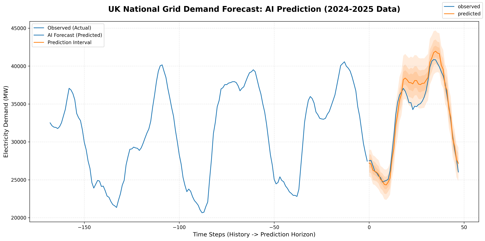
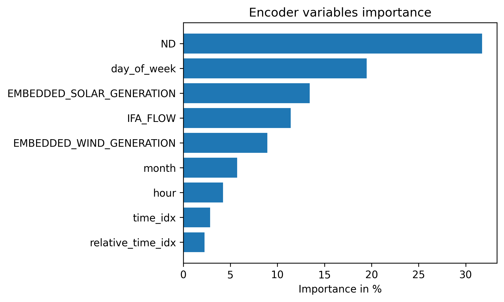

# UK National Grid Demand Forecasting (TFT)


## Overview

This repository contains a deep learning pipeline for forecasting UK electricity demand using a **Temporal Fusion Transformer (TFT)**. The model is trained on 2024-2025 National Grid data, incorporating multivariate inputs such as solar/wind generation and interconnector flows (IFA) to generate probabilistic forecasts.

The objective is to provide uncertainty estimates (quantiles) for grid stability analysis rather than single-point predictions.

## Key Features

* **Model Architecture:** Google's Temporal Fusion Transformer (TFT) for interpretable multi-horizon forecasting.
* **Data Pipeline:** Merges demand signals with weather-dependent generation (Solar/Wind) and cross-border flows.
* **Probabilistic Output:** Predicts p10, p50, and p90 quantiles to model demand uncertainty.
* **Interpretability:** Includes a custom script (`src/interpret_model.py`) to visualize attention weights and variable importance.

---

## Results

Validation was performed on a hold-out set (last 4 weeks of the dataset).


*Figure 1: Validation predictions vs. observed demand. The model captures daily seasonality and peak load hours effectively.*

### Interpretability Analysis

Feature importance analysis confirms that the model relies on logical dependencies:

| Future Drivers (Decoder) | Historical Drivers (Encoder) |
| :--- | :--- |
|  |  |

* **Decoder:** `hour_of_day` is the dominant factor for short-term horizons.
* **Encoder:** Recent demand (`ND`) and renewable generation levels (`SOLAR_GENERATION`) heavily influence the forecast context.

---

## Setup & Usage

### Prerequisites
* Python 3.9+
* Virtual environment recommended

### Installation

```bash
git clone [https://github.com/egeoguzz/uk-grid-tft-forecasting.git](https://github.com/egeoguzz/uk-grid-tft-forecasting.git)
cd uk-grid-tft-forecasting
pip install -r requirements.txt

Batch Size: 64
